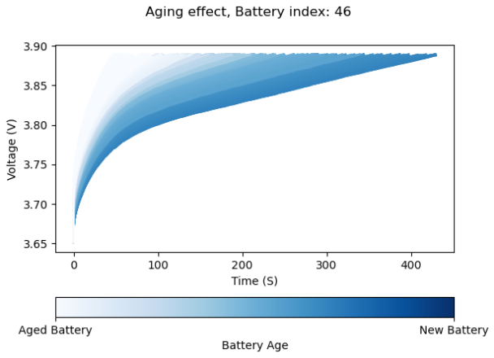

# Overview - Battery State of Health Estimation

## Overview
A Battery Management System (BMS) is a crucial component in any xEV, responsible for monitoring, protecting, and optimizing battery performance.

- **Battery State Estimation Algorithms** lie at the core of the BMS. These algorithms compute battery states, which are essential for monitoring and controlling the battery system, as well as providing feedback to the operator.
- **State of Health (SoH)** is a key parameter that reflects the degradation of battery performance over time. It can be expressed as:
  - The remaining battery capacity relative to its capacity when new, or
  - The change in the battery's internal resistance.

This project demonstrates **Li-Ion battery aging estimation** using a **multilayer perceptron (MLP)**. An approach inspired by the paper [1] with some modifications.

In this work, the **remaining capacity** is selected as the SoH indicator. The model is trained and validated using an open-source dataset containing cycling data from 48 NMC-Graphite Sanyo/Panasonic UR18650E cylindrical cells.

- **Neural network input:** Voltage samples from the aging dataset over a defined input window and the total time of the sequence
- **Neural network output:** The remaining capacity of the battery

The illustration below shows how the voltage profile within the input window evolves over the cell's lifetime:

## Contents

`Data` 	- This folder contains the dataset we used for training, which was generated from the original open source cycling data, available at: https://git.rwth-aachen.de/isea/battery-degradation-trajectory-prediction

To prepare the data for model training, voltage–time profiles were extracted from each battery cycle. First, the raw measurements were filtered to include only valid charging segments within a specified voltage range. These segments were then aligned in time, resampled to a fixed number of points, concatenated with the total time and paired with the corresponding battery capacity values to form the training samples. Each sample, a.k.a data-label files, represents one cycle’s charging curve along with its measured state of health (SoH), making it suitable for direct use in our model.

`Models` - Folder where the trained model, its predictions and generated Edge code are saved.

`Resources`	- This folder contains additional files. 

## Taking the project further
Below are some points to expand and improve the topic further:
- Expanding the dataset: include a wider range of manufacturers, operating conditions, and possibly chemistries. Additionaly, use data augmentation to increase the training data. Finally, incorporating different charging profiles is essential to replicate real world conditions.

- Incorporating more sensors data: such as current and temperature to provide the model with richer information for more robust and accurate state-of-health estimation. 

- Investigate approaches such as residual learning to increase the robustness of the model against sensors inaccuracies in the deployment environment.

## References
<a id="1">[1]</a>
Li, W., Sengupta, N., Dechent, P., Howey, D., Annaswamy, A., & Sauer, D. U. (2021). Online capacity estimation of lithium-ion batteries with deep long short-term memory networks. Journal of power sources, 482, 228863.
